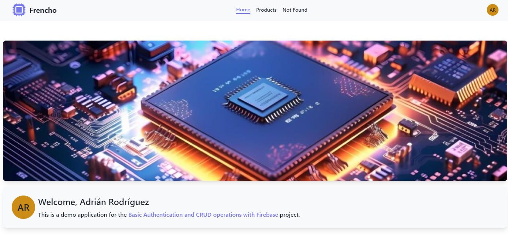
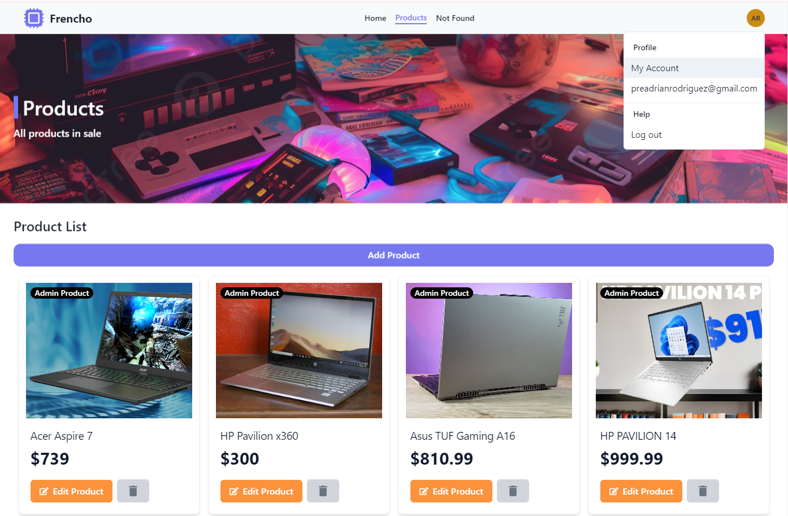
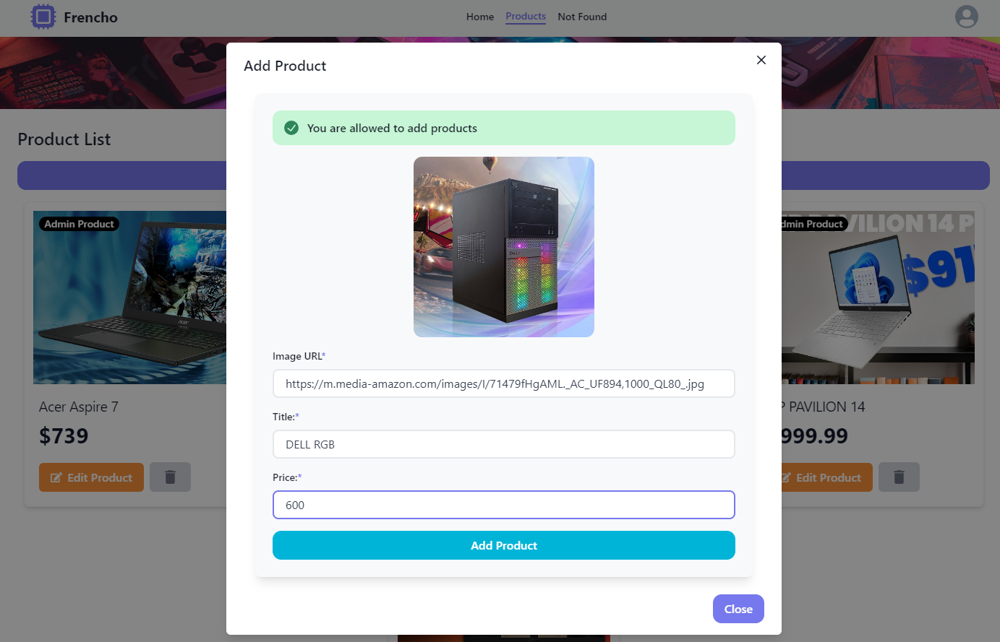

# Firebase Auth + Redux Toolkit - Products CRUD

Task developed by [**@1frencho**](https://github.com/1frencho) assigned from Kodigo Academy.

### Desktop Demo - Authenticated



### Desktop Demo - Product List



### Desktop Demo - Add Products Modal



## Technologies/Languages/Services used:

- React (Build with Vite)
- TypeScript
- Firebase: PRODUCTS CRUD - Auth and Database.

## Libraries/Packages used:

- Tailwind CSS
- Chakra UI (UI) - Just for (SideMenu, Drawer), other components are made with Tailwind CSS
- Framer Motion
- React Hook Form (Task applied on Auth Forms)
- Yup with React Hook Form
- React Router
- React Icons
- Redux Toolkit

## Use development workspace:

```
npm install
```

```
npm run dev
```
